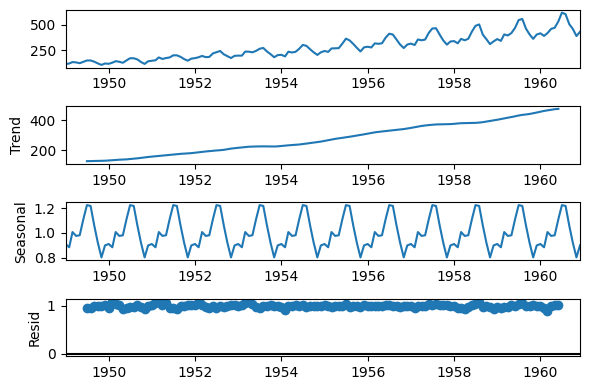

## Smoothing exponencial forecasting

Smoothing exponencial forecasting is a way to model and predict the behavior of a sequence of values over a time series. Smoothing exponencial is one of the most popular forecasting techniques for time series for their simplicity.

A time series could be the components: Trend(T), seasonal (S) and residuals (R). Those could be  two interactios among them: Additive is the case when the components add in the model and multiplicative when the components has a combined interaction between them.

$$\text{X_{(t)}} = T_{(t)} + S_{(t)} + R_{(t)}, /qquad \text{additive effect}$$
$$\text{X_{(t)}} = T_{(t)} * S_{(t)} * R_{(t)}, /qquad \text{multiplicative effect}$$

A example from a multiplicative effect in a time series.

To do Forecasting always requires a model, and smoothing exponencial is a way to model three aspects of the time series: a typical value (average), a slope (trend) over time, and a cyclical repeating pattern (seasonality).

There are three types of model, simple exponencial smoothing (SES) to estimate a typical value, double exponencial smoothing (DES) to estimate the typical value and trend, and the triple exponencial smoothing (TES) add the seasonal pattern. 

## Measures to choose the model

In time series exists measures to compare among models, and there are: Squared Error Sum (SSE), Akaike information criteria (AIC) and bayesian information criteria (BIC).

## What do you find on notebook?

The notebook use the statsmodels library and includes the code to fit the exponencial smoothing, how to find the measures to identify the best model and how to predict to the future.